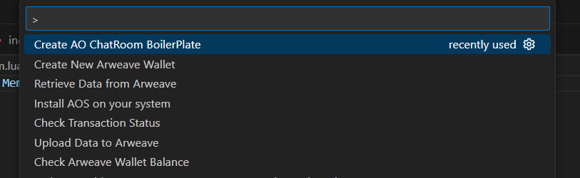
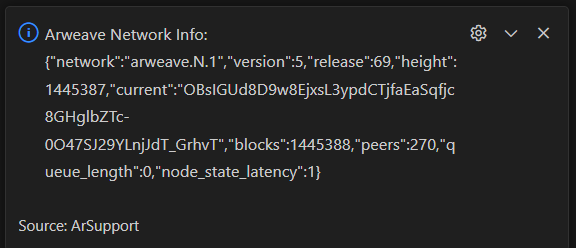
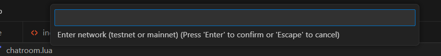
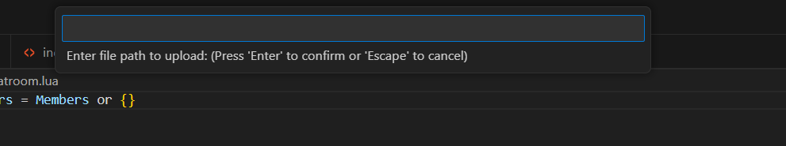
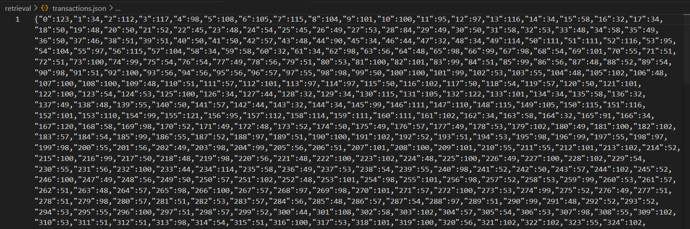
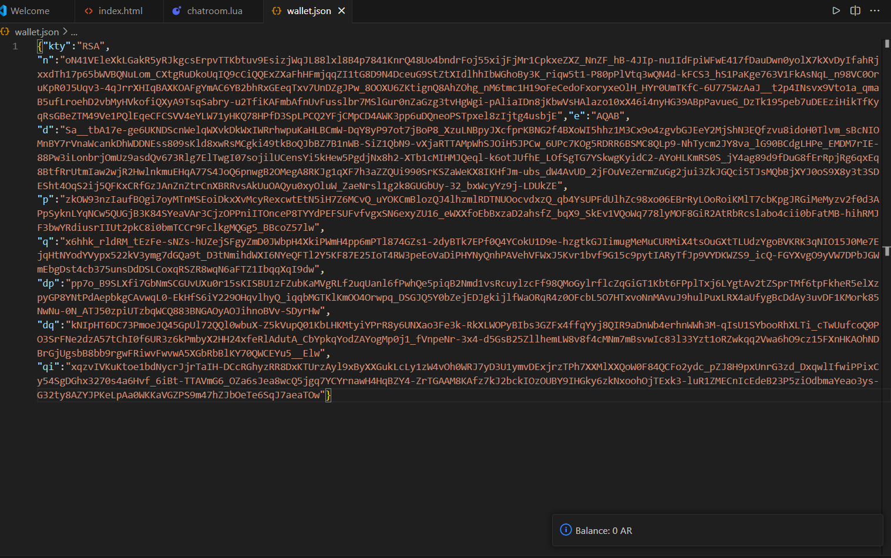
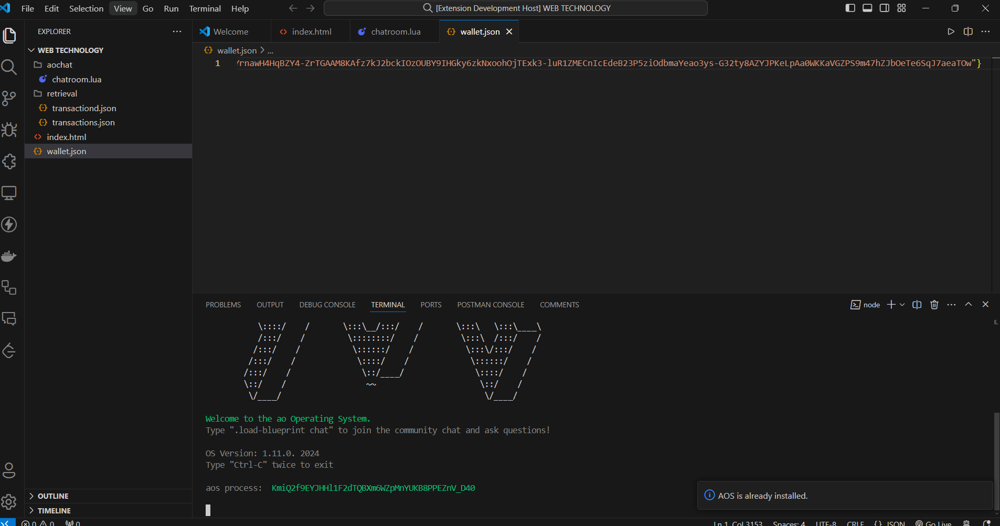
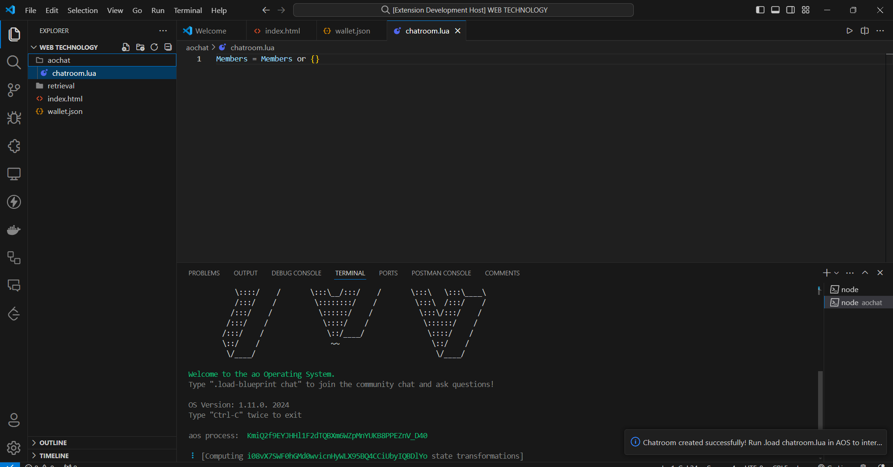
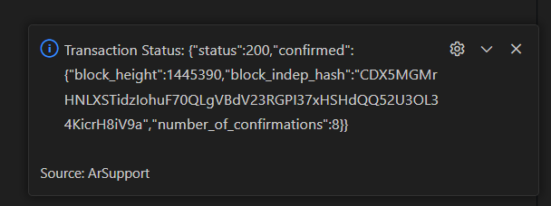

# ArSupport Extension

## Overview

ArSupport is a VS Code extension designed to simplify interaction with the Arweave blockchain. This extension provides a variety of commands to manage transactions, upload and retrieve data, and interact with Arweave directly from the Visual Studio Code environment.

## Features

- **Fetch Arweave Network Info:** Get the current status of the Arweave network.
- **Upload Data to Arweave:** Upload data directly from the VS Code editor to Arweave.
- **Create Transaction on Arweave:** Create and post a transaction with data from the active text editor.
- **Retrieve Data from Arweave:** Retrieve and save data from a specified transaction ID.
- **Fetch Arweave Account Info:** Get the balance and address information of the Arweave wallet.
- **Check Arweave Wallet Balance:** Check the balance of your Arweave wallet.
- **Create New Arweave Wallet:** Generate a new Arweave wallet and save it locally.
- **Check Transaction Status:** Check the status of a specified transaction ID.
- **Install AOS:** Install Arweave Operating System (AOS) on your system.
- **Create AO ChatRoom Boilerplate:** Generate a basic AO chatroom Lua script.

## Installation

1. Ensure you have Node.js installed on your system. You can download it from [Node.js](https://nodejs.org/).
2. Install the extension from the Visual Studio Code Marketplace or manually by cloning this repository and running `npm install` in the extension directory.

## Screenshots
- Opening up the command palette after Installing the extension, you would see the following options
 
1. **Fetch Arweave Network Info**

2. **Upload Data to Arweave**
- A prompt would appear asking you to select the network you want to upload to and the file path of the data you want to upload

3. **Create Transaction on Arweave**
- Similar to the upload data command, a prompt would appear asking you to select the network you want to upload to and caputer the content of the active text editor
4. **Retrieve Data from Arweave**
- A prompt would appear asking you to enter the transaction ID of the data you want to retrieve
- The data would be saved in a file in the root directory of the workspace with uint8 encoding array

5. **Fetch Arweave Balance Info**
- The balance of the wallet would be displayed in the output window/ the wallet address would be taken from wallet.json file in the root directory of the workspace

6. **Install AOS**
- The extension would check if Node.js and npm are installed on your system and install AOS if it are not installed
- If AOS is already installed, a message would be displayed in the output window

7. **Create AO ChatRoom Boilerplate**
- A basic AO chatroom Lua script would be generated and saved in the aochat folder in the root directory of the workspace

8. **Check Transaction Status**
- A prompt would appear asking you to enter the transaction ID of the transaction you want to check the status of

## Commands

### Fetch Arweave Network Info

Get the current status of the Arweave network.

**Command:** `extension.networkInfo`
**Title:** `Fetch Arweave Network Info`

### Upload Data to Arweave

Upload data from the active text editor to Arweave. You will be prompted to select the network (testnet or mainnet) and provide the file path to upload.

**Command:** `extension.uploadData`
**Title:** `Upload Data to Arweave`
### Create Transaction on Arweave

Create a transaction with data from the active text editor and post it to Arweave. You will be prompted to select the network (testnet or mainnet).

**Command:** `extension.createTransaction`
**Title:** `Create Transaction on Arweave`

### Retrieve Data from Arweave

Retrieve data from a specified transaction ID and save it locally.

**Command:** `extension.retrieveData`
**Title:** Retrieve Data from Arweave

### Fetch Arweave Account Info

Get the balance and address information of the Arweave wallet.

**Command:** `extension.accountInfo`
**Title:** `Fetch Arweave Account Info`
### Check Arweave Wallet Balance

Check the balance of your Arweave wallet.

**Command:** `arsupport.checkBalance`
**Title:** `Check Arweave Wallet Balance`
### Create New Arweave Wallet

Generate a new Arweave wallet and save it locally.

**Command:** `arsupport.createWallet`
**Title:** `Create New Arweave Wallet`
### Check Transaction Status

Check the status of a specified transaction ID.

**Command:** `arsupport.transactionStatus`
**Title:** `Check Transaction Status`
### Install AOS

Install Arweave Operating System (AOS) on your system. This command checks for Node.js and npm, and installs AOS if not already installed.

**Command:** `arsupport.installAOS`
**Title:** `Install AOS`
### Create AO ChatRoom Boilerplate

Generate a basic AO chatroom Lua script and save it to the `aochat` folder in your workspace.

**Command:** `arsupport.createAOChat`
**Title:** `Create AO ChatRoom Boilerplate`
## Usage

1. **Open Command Palette:** Press `Ctrl+Shift+P` to open the Command Palette.
2. **Run Commands:** Type the command you want to run (e.g., `Arweave:Network Info`) and press Enter.
3. **Follow Prompts:** Follow any additional prompts to complete the command.

## Contributing

1. Fork the repository.
2. Create a new branch (`git checkout -b feature/YourFeature`).
3. Commit your changes (`git commit -am 'Add some feature'`).
4. Push to the branch (`git push origin feature/YourFeature`).
5. Create a new Pull Request.

## License

This project is licensed under the MIT License. See the [LICENSE](LICENSE) file for details.

## Support

If you encounter any issues or have any questions, please open an issue in the [GitHub repository](https://github.com/haard18/AR-Support/issues).

---

Thank you for using ArSupport! We hope this extension makes your interaction with the Arweave blockchain more efficient and seamless.